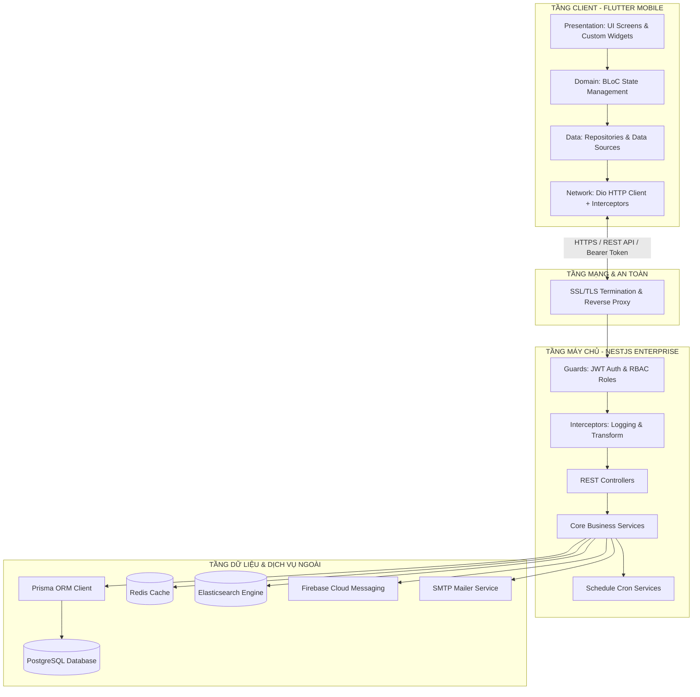
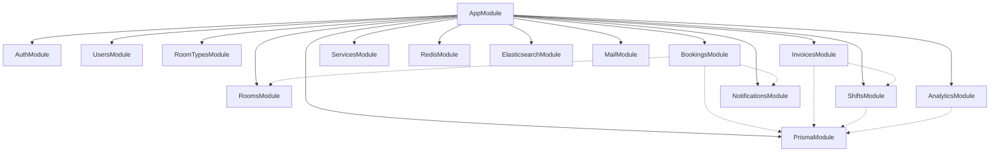
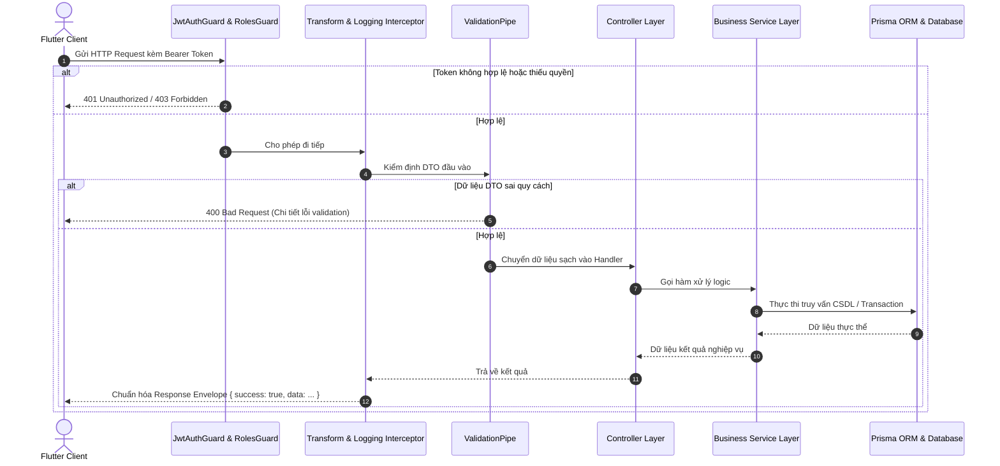
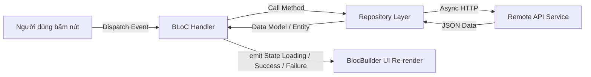
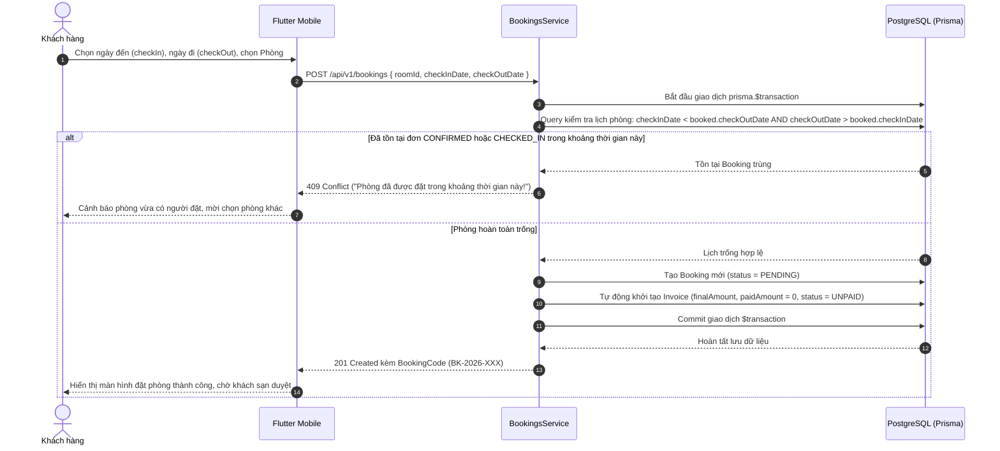
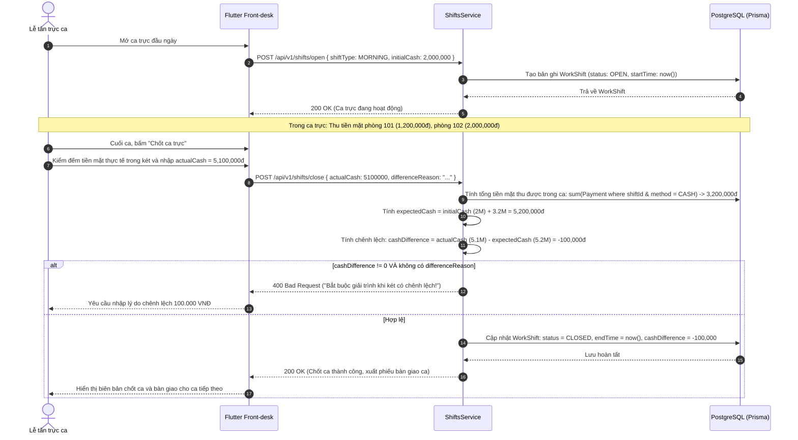
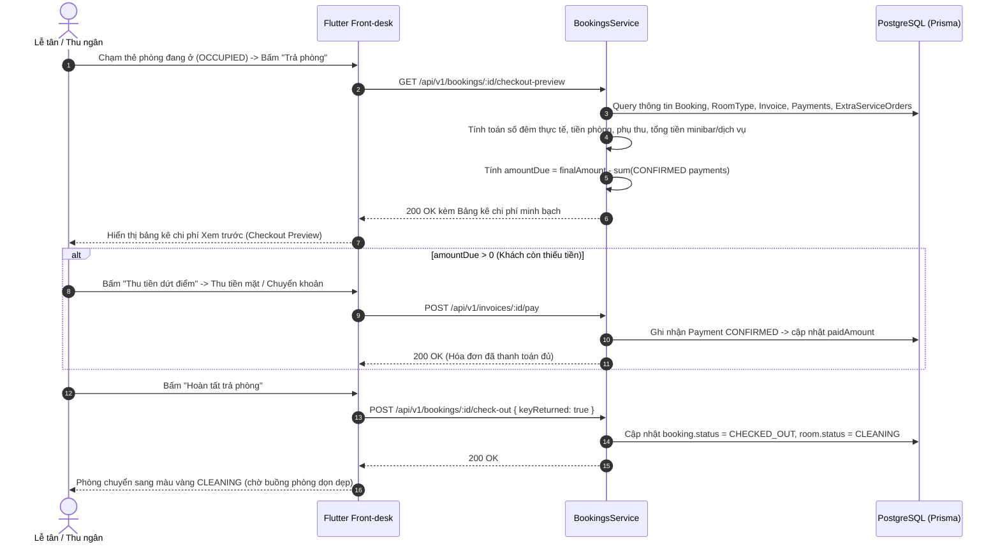
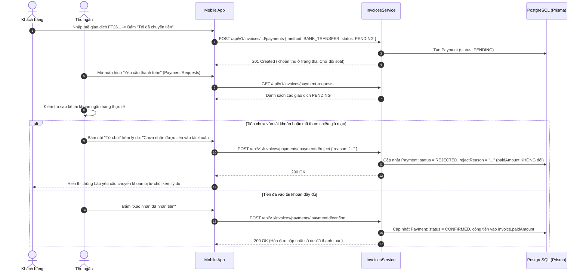
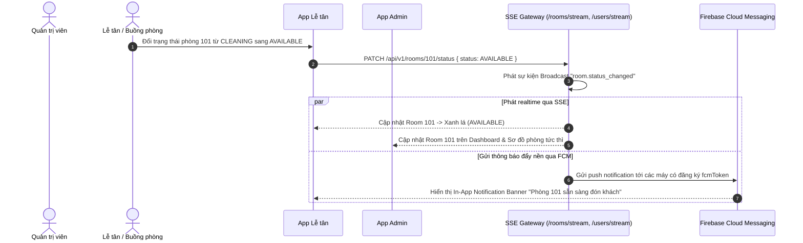

# TÀI LIỆU THIẾT KẾ KIẾN TRÚC VÀ CHI TIẾT HỆ THỐNG (SAD - SOFTWARE ARCHITECTURE & DESIGN DOCUMENT)
## DỰ ÁN: HỆ THỐNG QUẢN LÝ KHÁCH SẠN TOÀN DIỆN LUXE GRAND HOTEL

---

## 1. TỔNG QUAN KIẾN TRÚC HỆ THỐNG (SYSTEM ARCHITECTURE OVERVIEW)

### 1.1. Phong cách kiến trúc (Architectural Styles)
Hệ thống Luxe Grand Hotel được xây dựng theo phong cách kiến trúc **Client-Server phân tán**, kết hợp giữa:
1. **Modular Monolith (Backend):** Toàn bộ mã nguồn máy chủ được gom thành một đơn vị triển khai duy nhất (Single Deployable Unit) nhưng được chia thành các Module độc lập cao (High Cohesion, Low Coupling). Mô hình này giúp tối ưu hóa chi phí vận hành hạ tầng, đảm bảo tính nhất quán của các giao dịch cơ sở dữ liệu (ACID Transactions) mà không phải đối mặt với sự phức tạp của kiến trúc Microservices phân tán.
2. **Feature-First Clean Architecture (Mobile Client):** Mã nguồn ứng dụng Flutter được cấu trúc theo từng nhóm tính năng (Feature-driven), phân tách độc lập giữa tầng Dữ liệu (Data), tầng Nghiệp vụ/Trạng thái (Domain/BLoC) và tầng Giao diện (Presentation).
3. **RESTful API & JSON Protocol:** Chuẩn giao tiếp không trạng thái (Stateless) qua giao thức mạng bảo mật HTTPS.



---

## 2. THIẾT KẾ CHI TIẾT BACKEND (NESTJS ENTERPRISE ARCHITECTURE)

### 2.1. Cấu trúc Module Dependency Graph
Mỗi module trong NestJS chịu trách nhiệm trọn vẹn cho một miền nghiệp vụ, bao gồm: `Controller` (Tiếp nhận HTTP request), `Service` (Xử lý nghiệp vụ lõi), `DTO` (Định nghĩa và kiểm định dữ liệu đầu vào) và các `Entity/Event`.



### 2.2. Vòng đời xử lý một HTTP Request (Request Lifecycle)
Mọi request gửi tới Backend đều trải qua một chuỗi các lớp lọc bảo mật và chuẩn hóa nghiêm ngặt:



### 2.3. Hiện thực hóa các thành phần cốt lõi phía Server

#### 1. Bộ lọc ngoại lệ toàn cục (Global Exception Filter)
Mọi lỗi phát sinh trong hệ thống (Validation error, Not found, Conflict, Internal server error) đều được bắt và định dạng theo quy chuẩn chung:
```typescript
@Catch()
export class AllExceptionsFilter implements ExceptionFilter {
  catch(exception: unknown, host: ArgumentsHost) {
    const ctx = host.switchToHttp();
    const response = ctx.getResponse<Response>();
    const status = exception instanceof HttpException 
      ? exception.getStatus() 
      : HttpStatus.INTERNAL_SERVER_ERROR;

    const message = exception instanceof HttpException
      ? (exception.getResponse() as any)?.message || exception.message
      : 'Đã xảy ra lỗi máy chủ nội bộ. Vui lòng thử lại sau.';

    response.status(status).json({
      statusCode: status,
      success: false,
      message: Array.isArray(message) ? message[0] : message,
      timestamp: new Date().toISOString(),
    });
  }
}
```

#### 2. Decorators phân quyền động (Role-Based Access Control)
```typescript
export const ROLES_KEY = 'roles';
export const Roles = (...roles: Role[]) => SetMetadata(ROLES_KEY, roles);

@Injectable()
export class RolesGuard implements CanActivate {
  constructor(private reflector: Reflector) {}
  canActivate(context: ExecutionContext): boolean {
    const requiredRoles = this.reflector.getAllAndOverride<Role[]>(ROLES_KEY, [
      context.getHandler(),
      context.getClass(),
    ]);
    if (!requiredRoles) return true;
    const { user } = context.switchToHttp().getRequest();
    return requiredRoles.includes(user.role);
  }
}
```

---

## 3. THIẾT KẾ CHI TIẾT FRONTEND (FLUTTER MOBILE ARCHITECTURE)

### 3.1. Cấu trúc thư mục Feature-First
```
lib/
├── core/                  # Thành phần cốt lõi của ứng dụng
│   ├── constants/         # Màu sắc, font chữ, đường dẫn API
│   ├── network/           # Cấu hình Dio Client, PrettyLogger, AuthInterceptor
│   ├── theme/             # Theme sáng/tối chuẩn phong cách 5 sao
│   └── utils/             # Helper hàm xử lý định dạng tiền tệ VNĐ, ngày tháng
├── di/                    # Dependency Injection Container (GetIt setup)
├── shared/                # Widget dùng chung toàn app (Buttons, Textfields, Shimmer)
└── features/              # Chia theo từng module nghiệp vụ
    ├── auth/              # Đăng nhập, Đăng ký, Quên mật khẩu OTP
    │   ├── bloc/          # AuthBloc, AuthEvent, AuthState
    │   ├── screens/       # LoginScreen, RegisterScreen, ForgotPasswordScreen
    │   └── data/          # AuthRepository & RemoteDataSource
    ├── customer/          # Trải nghiệm khách hàng
    │   ├── screens/       # HomeScreen, SearchScreen, RoomDetailScreen, MyBookingsScreen
    │   └── widgets/       # CreateBookingModal, RoomCard
    ├── receptionist/      # Nghiệp vụ lễ tân & Quầy tiền sảnh
    │   ├── screens/       # RoomMatrixScreen, FrontDeskTodayScreen, ShiftCloseScreen, BookingApprovalScreen, PaymentRequestsScreen
    │   └── widgets/       # WalkInModal, ChangeRoomSheet, ShiftBanner, CheckOutSheet, AddServiceSheet
    ├── cashier/           # Nghiệp vụ thu ngân & Hóa đơn
    │   ├── bloc/          # InvoiceBloc, InvoiceEvent, InvoiceState
    │   └── screens/       # CashierInvoicesScreen, PaymentSheet, RefundSheet
    ├── admin/             # Trung tâm quản trị & Vận hành
    │   ├── bloc/          # UserBloc, TodayCheckOutsBloc
    │   ├── screens/       # AdminDashboardScreen, ReportsScreen, RoomOperationsScreen, UserManagementScreen, AdminShiftManagementScreen, ShiftDetailScreen, ServiceCatalogScreen, RoomTypeManagementScreen
    │   └── widgets/       # RevenueBarChart, OccupancyCard, EditRoomModal
    ├── profile/           # Quản lý thông tin tài khoản cá nhân
    │   └── screens/       # ProfileScreen (Hồ sơ, Đổi mật khẩu, Tải Avatar)
    └── notifications/     # Trung tâm thông báo & Cài đặt
        ├── models/        # AppNotificationModel
        ├── repositories/  # NotificationRepository
        └── screens/       # NotificationsScreen, NotificationSettingsScreen
```

### 3.2. Mô hình quản lý trạng thái BLoC (Business Logic Component)
- **Cơ chế hoạt động:** Giao diện UI chỉ phát sinh Sự kiện (Event). BLoC xử lý nghiệp vụ bất đồng bộ, phát ra Trạng thái (State). Giao diện lắng nghe bằng `BlocBuilder` để vẽ lại màn hình:



- **Xử lý trạng thái an toàn:** Toàn bộ State kế thừa `Equatable` để so sánh giá trị nông (Shallow Equality), ngăn ngừa việc vẽ lại giao diện thừa thãi khi dữ liệu không thay đổi.

---

## 4. SƠ ĐỒ TUẦN TỰ CÁC QUY TRÌNH NGHIỆP VỤ LÕI (SEQUENCE DIAGRAMS)

### 4.1. Quy trình Đặt phòng & Chống xung đột trùng lịch (Race Condition Handling)



### 4.2. Quy trình Quản lý Ca trực Lễ tân & Đối soát Tiền két (Shift Reconciliation)



### 4.3. Quy trình Xem trước Hóa đơn & Quyết toán Trả phòng (Checkout Preview & Settlement)



### 4.4. Quy trình Đối soát & Từ chối Giao dịch Chuyển khoản Nghi vấn (Payment Rejection)



### 4.5. Cơ chế Đồng bộ Dữ liệu Thời gian thực (Realtime SSE & Push Notification)



---

## 5. THIẾT KẾ TẦNG DỮ LIỆU & TỐI ƯU HÓA (DATABASE DESIGN & OPTIMIZATION)

### 5.1. Chiến lược đánh chỉ mục (Database Indexing Strategy)
Để đảm bảo thời gian truy vấn dưới 50ms khi dữ liệu khách sạn tăng trưởng lớn, các chỉ mục (B-Tree Indexes) sau đây được thiết lập:
- **Bảng `rooms`:** `@@index([status])`, `@@index([floor])`, `@@index([roomTypeId])`.
- **Bảng `bookings`:** `@@index([status])`, `@@index([checkInDate])`, `@@index([checkOutDate])`, `@@index([roomId, status])`, `@@index([customerId, status])`.
- **Bảng `invoices`:** `@@index([paymentStatus])`, `@@index([paidAt])`, `@@index([issuedById])`.
- **Bảng `payments`:** `@@index([invoiceId])`, `@@index([status])`, `@@index([shiftId])`, `@@index([confirmedById, status, confirmedAt])`.
- **Bảng `work_shifts`:** `@@index([staffId])`, `@@index([status])`, `@@index([startTime])`.

### 5.2. Toàn vẹn tham chiếu (Referential Integrity Constraints)
- Khi một `Booking` bị xóa, toàn bộ `Invoice`, `Payment` và `ExtraServiceOrder` liên quan sẽ bị xóa theo cơ chế **CASCADE** để tránh dữ liệu rác mồ côi.
- Không cho phép xóa một `RoomType` nếu vẫn còn `Room` đang tham chiếu (Ràng buộc **RESTRICT**).
- Không cho phép xóa một `User` nếu người đó đang là chủ thể của một đơn đặt phòng hoặc ca trực đang hoạt động (Ràng buộc **RESTRICT**).

---

## 6. THIẾT KẾ TÍCH HỢP HỆ THỐNG NGOÀI (EXTERNAL INTEGRATIONS)

### 6.1. Tầng đệm Redis Cache (In-Memory Caching Strategy)
- **Chiến lược:** Áp dụng mô hình **Cache-Aside Pattern**.
- **Dữ liệu đệm:** Danh mục loại phòng (`room_types`), Danh mục dịch vụ khách sạn (`hotel_services`), Thống kê doanh thu tháng (`revenue_summary`).
- **Thời gian hết hạn (TTL):** Thiết lập TTL 600 giây (10 phút) đối với dữ liệu thống kê, 3.600 giây đối với danh mục tiện ích.
- **Xóa đệm chủ động (Cache Invalidation):** Khi Admin cập nhật giá phòng hoặc thêm dịch vụ mới, sự kiện `RoomUpdatedEvent` sẽ tự động xóa các khóa Cache tương ứng trên Redis.

### 6.2. Máy chủ tìm kiếm Elasticsearch
- Dữ liệu phòng và loại phòng được đồng bộ tự động sang Elasticsearch Index `hotel_rooms`.
- Truy vấn hỗ trợ phân tích từ khóa mờ (Fuzzy matching), tìm kiếm đa tiêu chí (giá, tiện nghi, số người) mà không làm tăng tải tính toán trên máy chủ cơ sở dữ liệu chính PostgreSQL.

### 6.3. Thông báo đẩy Firebase Cloud Messaging (FCM)
- Mỗi thiết bị người dùng sau khi đăng nhập thành công sẽ gửi mã `fcmToken` lên Backend lưu vào bảng `users`.
- Khi trạng thái đơn phòng thay đổi (`CONFIRMED`, `CHECKED_IN`, `CHECKED_OUT`), Service thông báo sẽ gửi payload qua `firebase-admin` tới đúng token của thiết bị đó.

---

## 7. KIẾN TRÚC AN TOÀN VÀ BẢO MẬT (SECURITY ARCHITECTURE)

1. **Mã hóa truyền thông:** Bắt buộc chứng chỉ SSL/TLS 1.3 cho toàn bộ kết nối mạng giữa Mobile App và Server.
2. **Mã hóa dữ liệu lưu trữ:** Mật khẩu người dùng được băm qua Bcrypt với 10 vòng lặp muối (Salt Rounds). Mã bí mật JWT (`JWT_SECRET`) được lưu trong biến môi trường bảo mật, không đưa lên kho mã nguồn.
3. **Phòng chống các cuộc tấn công phổ biến:**
   - **SQL Injection:** Triệt tiêu hoàn toàn nhờ Prisma ORM Parameterized Query.
   - **XSS (Cross-Site Scripting):** Sử dụng thư viện `class-validator` và `class-transformer` để lọc sạch (Sanitize) mọi chuỗi ký tự đầu vào.
   - **Rate Limiting:** Sử dụng `@nestjs/throttler` giới hạn tối đa 100 requests/phút cho mỗi địa chỉ IP để chống tấn công từ chối dịch vụ (DoS/Brute Force) vào các cổng đăng nhập/quên mật khẩu.
